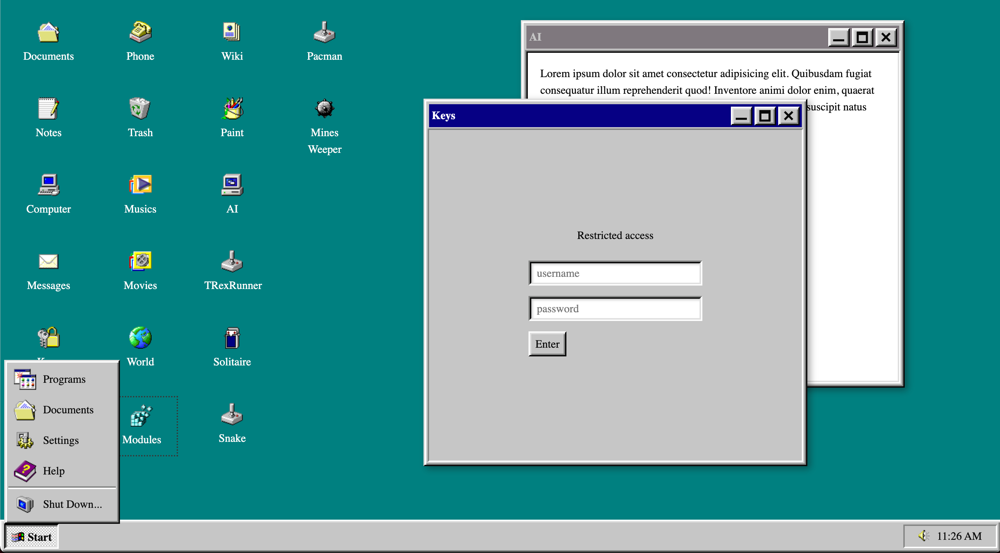
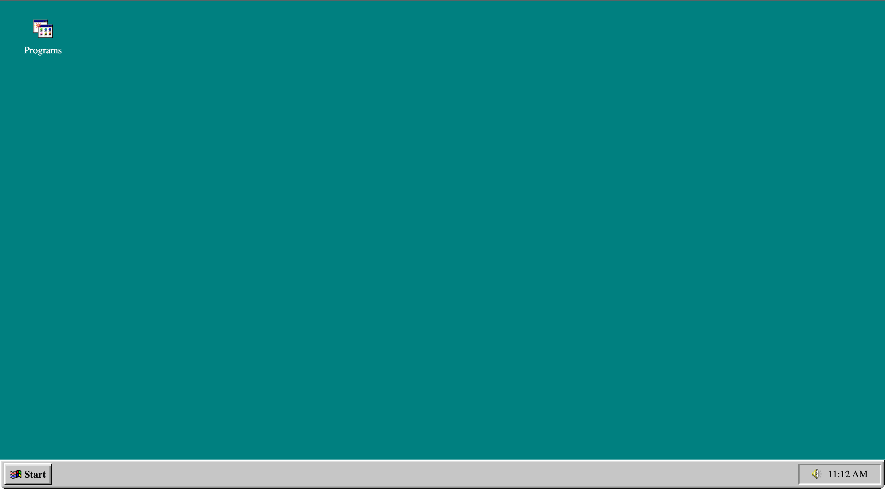
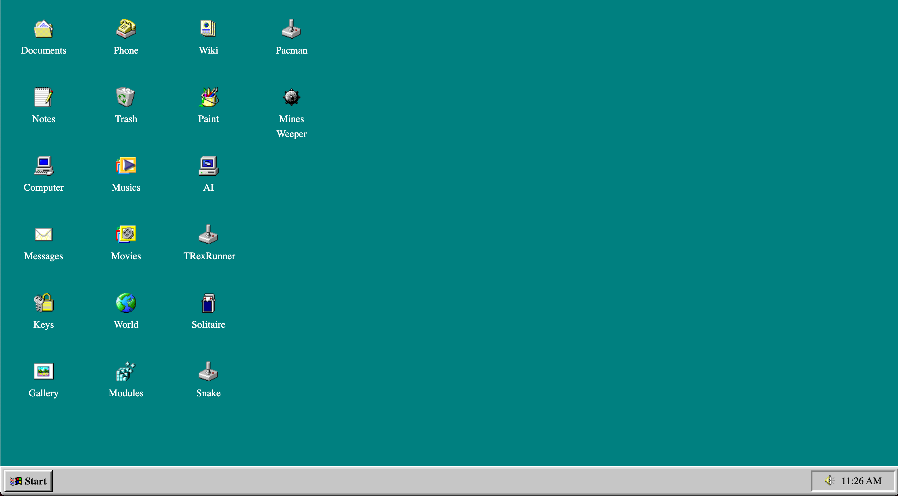

<h1 align="center">@react-os/core</h1>

<p align="center">
  <a href="https://www.npmjs.com/package/@react-os/core"></a>
  <a href="https://www.npmjs.com/package/@react-os/core"></a>
  <a href="https://www.npmjs.com/package/@react-os/core"></a>
</p>
<h3 align="center">
  <a href="https://react-os-docs.netlify.app">Docs</a> -
  <a href="https://react-os-demo.netlify.app">Demo</a>
</h3>
<p align="center">
  <b>Refreshed</b> UI components for your vintage web OS.</p>



# Getting Started

First, install component library in your project directory:

```sh
# yarn
$ yarn add @react-os/core

# npm
$ npm install @react-os/core
```

Set OSProvider in your app with config of your choice... and you are ready to go!

```jsx
import React from 'react'
import { Frame } from 'react95'
import { React95Provider, OsProvider, OsWindow } from '@react-os/core'

const Notes = ({ data }) => (
  <OsWindow size={[540,480]}>
    <Frame variant="field">
      <p>
        {data.label} is an example of a program!
      </p>
    </Frame>
  </OsWindow>
)

const App = () => (
  <React95Provider>
    <OsProvider
      programs={[
        {
          menu: true,
          desktop: true,
          label: "Notes",
          icon: "address_book_pad",
          component: props => <Notes {...props} />
        },
        // more programs here...
      ]}
    />
  </React95Provider>
)

export default App
```

# Screenshots



<!--  -->

# Submit your project

Apps built with ReactOS will be featured on the official [website](https://react-os-docs.netlify.app).

# Contributing

If you want to help with the project, feel free to open pull requests and submit issues or component proposals. Let's bring this UI back to life.

